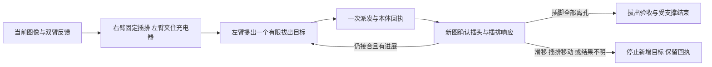

# 双臂插头转移

这是现有 Piper 与 RealSense 能力的薄集成项目，任务是将原插头拔出，插入初始正视图中左侧相邻插座。当前实物任务尚未完成。该项目不生成或自动执行轨迹。

2026-10-09 最终拔出记录：用户随后改为只操作左臂；新 RGB 确认充电器已拔出并保持夹持，未执行移插或释放。额外 10 cm 上提因后续 J5 故障未完成。有效视频保留 27 个动作片段，核心修复、实际边界和下载文件索引见 [本次结果](../../research/plug_extraction_20261009/README.md)。以下启动失败及协作方案保留为历史，不能代替该轮最终记录。

2026-10-09 10:06 本轮状态：两臂关节启动已成功，夹爪仍失能。用户确认插排断电、右空爪两指完全接触；右爪负开口 −5.46 mm 的一次原厂置零帧完整返回，但没有收到成功 ACK，后续被动反馈为 −1.33 mm，故障已保留，未重发或继续夹紧／拔出。三路录像正常封口，每路1307帧、无记录帧号缺口；录像仅覆盖此次准备及失败诊断。新1000步／三小时任务窗口尚未登记，不以新 run 绕过故障。证据见 `artifacts/gripper_zero_20261009/`（仓库根目录）。

下一次测试的设计见[右臂固定、左臂拔出的协作方案](#右臂固定左臂拔出的协作方案设计稿)。此方案仅设计，尚未接通当前接触恢复会话的运动接续。

所有机械臂调用都转发给一个长期保留的 `ToolService`，固定使用 `../piperx_cloth_demo` 和其 `runs/pair_sessions.sqlite`。本目录的日志仅记录任务上下文、请求、图片和回执，不能替代或重置机器人账本、故障、预算或 owner。新会话可显式冻结拔插工作臂，另一臂固定插排；按当前图像就近分配，避免为套用旧角色而多余换位。左右手角色、宿主任务、派生 recipe 和抓持记录必须一致，不能在一次发送中临时交换。

## 离线查看

```bash
cd /home/agilex/GPT6-Astra-REAL/projects/dual_arm_plug_transfer
./plug inspect
./plug plan
./plug plan --worker-arm left
/home/agilex/miniconda3/envs/pi0_infer/bin/python -m unittest discover -s tests -v
```

`inspect` 只读取当前固定配置和原账本，`plan` 展示已有 recipe。以上命令不打开 CAN 或相机。测试使用模拟服务与相机，也校验模拟相机元数据经过真实 `ToolService.pair_observe` 文件检查和 `PairHost._rgb` 准入格式；这不是实机成功或碰撞认证。

## 长期在线会话

```bash
./plug session --name attended-transfer-001 --worker-arm left --context '填入本次真实现场与安全监督说明'
```

进程启动后只输出 ready；不自动连接、使能、准备夹爪、回零、抓取或发送目标。保持该进程及 stdin，逐条写入 JSONL。每条含独立请求 ID、操作名和原样参数；等待回执并检查新图后再决定下一条。不要用文件预排整段轨迹。

```json
{"id":"context-1","op":"note","arguments":{"text":"记录当前所见、现场确认及动作目的；此文本不等于机器测量。"}}
{"id":"rgb-1","op":"capture","arguments":{}}
```

`capture` 显式启动并保留一个现成 `RealSenseRig(depth_enabled=False, rgb_only=True)`，输出三张 PNG 和原始 `observation.json` 路径。后续 capture 使用同一组流和真实帧号。绑定为 front `243322070709`、left_hand `336222071115`、right_hand `244222070415`。图片的左右与机械臂名称不能混用。这里只保存图，不自动让宿主观察或发送动作；原宿主仍会独立拒绝陈旧、重复帧、超时差或错误身份。

在当前原账本允许的已授权 run 中，显式调用 `robot_pair_open`，按原工具 schema 原样提供 `run_id`、`task_id`、`workspace_clearance_statement`、`connection_mode` 和实际已授权预算。新日志名不是新 run 授权。旧 owner、未决动作或故障导致拒绝时，保留该拒绝，不能另建数据库、换 run 或重启清故障。

使用上例的左工作臂时，`robot_pair_open` 还须显式传 `worker_arm="left", support_arm="right"`，与已审计的任务合同一致。默认旧会话仍为右工作、左支撑。`recipe.json` 是同一 canonical recipe 的角色投影，只改变手臂分工；初始图像中的左侧目标孔及物体完成证据保持原义。客户端在构造控制服务前拒绝与本会话不符的角色。

宿主连接后，将 capture 回执给出的真实路径交给 `robot_pair_observe`。随后使用其真实 observation/peer IDs，按当前照片和本体反馈调用一次已有 `robot_pair_submit_once`，用 `robot_pair_status` 读取回执，再重新取图。启动缺项只能由操作者显式请求原工具并满足原资格；本项目不自动补准备步骤。

工具请求形式为 `{"id":"唯一请求ID","op":"原robot_pair工具名","arguments":{原工具参数}}`。工具完整参数和适用范围以 [service.py](../piperx_cloth_demo/robot_tools/service.py) 与 [PAIR_HOST.md](../piperx_cloth_demo/docs/PAIR_HOST.md) 为准。`inspect` 列出允许的工具；不提供旧单臂发送、清故障、模式恢复或替代控制后门。原参数不加默认目标、不替换 ID、不自动重发。

会话日志保存在 `runs/<name>/task.json` 和 `session.jsonl`，相机图保存在同目录 `capture/`。请求先持久落盘，再调用原工具。重复请求 ID 被拒绝；查询动作使用新的请求 ID 和原 `event_id`。发现故障或未知工具结果后，只允许原 `status/cancel/close`，另可拍图和记录语义说明；不会通过换 owner 继续。

正常结束先显式 `robot_pair_close`，再结束 stdin。意外 EOF 委托原服务的 shutdown 行为锁存未正常关闭的会话，释放相机；不清账本。关闭客户端、断连、cancel 回执均不能自行证明物理停止。

## 任务完成证据

原 recipe 位于 [plug_transfer_left.json](../../tasks/plug_transfer_left.json)。必须分别核实原插孔为空、指定插头留在冻结的左侧目标孔、插排仍受桌面支撑、双爪已释放并远离，以及释放后至少两秒间隔的两次新图保持终态。机器人到位、测试通过或现场安全员在场都不替代这些结果；本项目不自动写任务成功。

`inspect` 显示有效 scope、其故障及当前 Linux boot 的 startup 记录；启动完成不等于任务重新准入。2026-10-08 16:25 会话已真实执行七段成功关节动作，另有一段完整发送后因左 J4 跟踪包络超差失败；充电器仍在原插座，尚未建立抓持。会话与录像正常关闭，故障保留，物理停止未被认证。见[该次结果](../../artifacts/plug_resume_20261008_1625/session_outcome.json)；后续接续与实物结果必须用新记录证明。

更早的接入记录见 [task_state.json](../../artifacts/dual_plug_supervised_20261008/task_state.json)。现成 prepare/首次目标入口支持 P 起点及未使能空爪；本客户端不绕过任何故障拒绝。状态文件与后来真实回执优先于历史 README，不能从界面可用推断已经发生移动。

2026-10-08 已通过新 CLI 做了两项在线核对：

- [相机核对记录](runs/sensor_check_20261008_1022/session.jsonl)：真实三路 RGB 拍摄成功，原始 PNG 和 `observation.json` 已保存；相机正常关闭，`cleanup_errors=[]`。该会话没有构造机械臂控制服务，CAN TX 为 0。
- [任务准入记录](runs/control_admission_20261008_1024/session.jsonl)：新 run 的显式 `robot_pair_open` 被原账本以 `Run is outside the explicitly authorized current round` 拒绝；原错误完整保留，未重试、未建立设备连接，会话正常关闭。

上述核对证明图片与拒绝回执链路可用；没有完成插头拔出、转移或插入。


2026-10-08 当前插头任务的右 J4 有界反馈档已接通：`robot_pair_open` 可显式传 `feedback_observation_profile="right_j4_bounded_v1"` 与原用户许可 `feedback_observation_statement`，冻结到任务合同。右 J4 上限 0.5°，其他关节仍为 0.003 rad；准备、RGB joint、试夹、保持和释放使用同一档，右臂静止 SO(3) 姿态也使用 0.5°，原始法兰平移、夹爪、限位及单次发送限制保持。新任务准入文件的 `site_context.feedback_observation` 必须一致，旧运行不在线换档、清故障或重新计时。具体字段、使用范围和离线证据见[反馈波动处理](../../.agents/skills/piper-task-pipeline/references/feedback-tolerance.md)。

## 右臂固定、左臂拔出的协作方案（设计稿）

2026-10-09 用户要求先设计、下一次再测试。本节不启动设备、不登记新轮、不生成可直接发送的目标，不修改控制代码。目标先缩到“充电器完整离开原插孔，插排保持桌面支撑”；向左插孔转移仍属后续阶段，不能把拔出当完整移插成功。

**分工：`worker_arm=left`，`support_arm=right`。** 右臂是抓持插排的任务臂。右臂移动时左臂保持；右臂夹稳后保持，左臂分段拔出。一次只动一臂，使用同一持久宿主、当前共同场景与另一臂的独立静止回执。沿用 canonical recipe 的 `render_plug_recipe` 角色投影，不另造硬件脚本，也不改变初始图中左侧目标插孔的身份。

### 起点与会话接续

最近一次[实机记录](../../artifacts/existing_supported_contact_20261009/actual_result.json)中，用户确认左侧两根夹指均贴住充电器；新接触观察及静态保持通过，开口为 33.25 mm。右爪为空，充电器仍与原插孔接合。这是历史观测，不能作为下一次的当前图像、夹力、拔出成功或已停止证明。

现有宿主是 `existing_supported_contact` 的零 TX 范围，没有当前连接的关节目标缓存。**右臂加入可复用双抓持拔出分支，但不会解除这项限制。** 正常路径要求在同一连接上先完成双空爪准备与两臂关节目标初始化，再建立两个抓持 episode；此后保持连接，不在夹住物体后重启控制宿主。

| 下次读到的实际状态 | 设计分流 |
| --- | --- |
| 同一有效连接、完整任务范围、所需关节缓存与来源齐全，左爪有效保持 | 保留左爪，右臂用普通接近/对齐建立抓持；不重复初始化。此条件不符合最近的零 TX 宿主。 |
| 与最近记录相同：左爪仍接触、零 TX 范围、关节缓存缺失 | 先补齐受支撑释放与正常会话交接。新图确认充电器仍由原插孔支撑后，每次最多开大 5 mm；开口变化不等于分离，必须新图及反馈确认两指离开。保留旧故障和三个已耗闭合试探，不能重发原目标。 |
| 已由现场改变为双空爪，或设备重启/旧轮到期 | 如实登记变化，只补对应启动、来源和会话缺项；历史缓存及旧抓持不继承。重启或到期不代表空爪；若仍接触，按上一分支处理。没有完整释放证据时不能仅凭旧状态表为空认定空爪。 |

当前零 TX 范围连释放也不允许，因此第二条是**需要实现的恢复分支，不是明天可直接调用的现成入口**。它应限定为左爪受支撑开爪和分离确认，右臂、本体零发送；完成后正常交接至完整任务宿主，再依次建立两臂空载关节目标。不能通过把旧抓持标成空、删除故障、复制旧缓存或删除初始化的空爪检查实现。初始化可能产生实际运动，须按入口计划核对近物通道并报告幅度；不要求回零，也不保证初始化零位移。

若这条恢复在测试前尚未实现并通过离线检查，测试只停留在观察，不宣称“右臂可以直接过来夹”。原轮截止是 2026-10-09 02:24:49，次日不能延用其时间窗口；实际开测时按当时授权登记新轮并保留历史。本设计不自动创建预算、清零局部失败或安排定时启动。重新抓持必须发生在真实分离、空载初始化及新阶段登记之后，不能改事件名继续已耗尽的三次试夹。

### 操作顺序与步长

每一行是一个阶段，不是预排的指令队列；每段都先说明幅度，再取当前 RGB 与反馈，发送一次，读回执及新图，再决定下一段。

| 阶段 | 动作与建议尺度 | 进入下一阶段的证据 |
| --- | --- | --- |
| 0. 准备 | 恢复分流完成后，双爪空载时依次完成必要限位来源与关节目标初始化，整个拔出过程保留同一连接 | 两臂当前有效来源、初始化回执、真实缓存；无未决发送 |
| 1. 右臂接近插排 | 双爪空载、远处通道清楚时可选 `coarse_approach`，优先约 3 cm 的目标；接近外壳后约 5–10 mm，最后约 1–3 mm。速度沿用原 1% | 右指对准可夹持外壳，未遮住原插孔、左目标孔及左臂拔出通道；左臂仍静止 |
| 2. 右臂固定 | 夹插排两侧外壳，保留桌面承托；`grip_supported` 每次闭合最多 5 mm，沿用原名义力参数。候选后用新图和零 TX retain 建立右侧保持 | 插排在右夹指间，仍贴桌面，未移位；右侧实际候选、静态 trace 和 episode 齐全 |
| 3. 左臂夹充电器 | 右臂保持。左臂若需修正，用普通近处小步；握充电器外壳，线缆自由。依次完成支持下试夹及新图 retain | 两个独立的有效抓持 episode；充电器仍在原孔，左右本体和夹爪反馈健康 |
| 4. 第一段试拔 | 右臂目标不变。左臂保持插头姿态，沿新图所见插脚离孔方向，提出约 1 mm 的模型末端目标 | 新图确认插排未跟随、插头未滑出手指、接合关系有无变化；先确认本段响应 |
| 5. 继续分离 | 上段响应清楚且有进展时，再选择约 1–2 mm；每段请求及编码终点不超过现有 2 mm、0.01 rad 限制 | 插脚逐步露出，最终全部离孔；每段 `loaded_pending_visual` 均被新图确认后才继续 |
| 6. 拔出验收 | 确认全部插脚离开原孔后，不再继续 `extract_segment`；记录左爪仍持有充电器、右爪仍固定桌面插排 | 源孔为空、插脚与源孔明确分离、插头仍在左爪、插排未被带起或拖走 |

这里的毫米数是候选机器人 FK 目标，不是从 RGB 测出的插脚脱离量，也不是实际全程位移保证。现有带载过程另受完整关节盒、最高 20 mm / 0.05 rad 的过程预算及原暂态守卫约束；最终仍须稳定到位。每段报告计划目标、实测关节/法兰变化、可见物体进展三项。约 1 mm 目标可能落在到位容差内却没有明确运动，必须如实记录。

粗接近目前要求**双爪均空载**。如果保留左爪既有抓持再接近右臂，不能直接启用 3–10 cm 粗档；使用普通档允许的有限步长。第一版不新增“左臂持物时右臂大步”的控制档。

夹点在新图中选择：优先可达、可夹住的插排外壳侧面，避开线缆出口、开关、插孔及相机/支架，尽量让支撑靠近受力处而不挡左臂。当前入口允许的最大命令开口为 55 mm；在此范围内找不到可用夹点时，应报告夹点问题，不用勾线、夹插脚或向下压的方式冒充现有支持式抓持。右爪名义参数不等于经标定的实际夹持力。

### 图像闭环与异常分流



- 拔出方向根据当前插脚、插孔面和外壳关系判断，不默认机器人全局 Z，也不沿历史坐标重播；第一版不加入摇晃、扭转或加力挣脱。
- 右侧静态保持与当前双臂反馈允许建立首次有界拔出尝试；能否抵住实际拔出反力，由这一段的新物体响应判断，不要求先有成功拔出轨迹或力曲线。关节静止本身不证明插排固定。
- 沿用 `robot_pair_submit_once` 的 `kind=joint`、`operation=extract_segment`、`admission_mode=rgb_supervised`，绑定当前两侧 episode、源/目标身份、物体描述和整臂通道。具体关节值由本段新图与本体状态生成，不写入本设计。
- 回执完成后必须新 RGB，再用 `robot_pair_confirm_loaded_response` 记录 `retained_between_fingers`、`table_supported_stationary`，以及实际的 `source_engaged` 或 `source_separated`。未确认前不发下一段，不从机器人到位自动认定拔出。
- 累计两次 `no_progress` 后终止继续分段；插排跟随、抬起、夹持滑移、明显偏轴或关系无法判断时立即停止新增目标，不通过反复微调或增加夹力消除失败。原三次闭合试探、无进展及总预算分别保留。
- 容差内的短暂反馈偏差按原分支记录并继续观察收敛；不重复拒绝已允许的右 J4 波动。持续偏离、陈旧反馈、硬边界或部分/未知发送仍锁存。RGB 带载当前为 `latch_only`，不能把取消、客户端退出或不再发指令称为已物理制动。

### 下一次测试的完成点

1. 先确认恢复与双空爪初始化入口确实接通，再开始录像与实际准备。已有两插座断电及净空陈述在同一未变现场沿用；只核对发生的变化。录像覆盖准备、双侧试夹、每段拔出与退出。
2. 第一项实物验收是右爪固定插排且左爪完成有效抓持；第二项是约 1 mm 首段及新图响应。两项通过后才逐段继续到完全离孔；不预先排队后续目标。
3. 本次设计的拔出验收需要源孔、插脚、左爪持物、右侧插排支撑四项图像证据，不把毫米累计和到位回执当作成功。若继续移插，另按当前新图进入既有搬运/对齐/插入阶段。
4. 如果测试在拔出后结束，应在原期限内选择新图可见、可达的独立支撑面，通过适用的带载搬运与受支撑释放入口放稳充电器，再释放桌面插排；两爪离开后用相隔至少两秒的新图确认稳定。支撑面/退出通道不清楚时不自动张爪或退出宿主，报告并由现场监督处理。拔出成功与放稳退出分别记账，不能默认夹住过夜或靠关闭进程结束。

### 实现边界与测试前检查

| 能力 | 当前状态及最小工作 |
| --- | --- |
| 左拔右扶角色、两个抓持、图像监督分段及新图确认 | 已有通用组件；复用 `plug_recipe.py`、`host_grasp.py`、`host_loaded.py`、`loaded_episode.py`，不新增单臂桌面支撑分支 |
| 当前零 TX 接触范围结束并交接正常任务 | 尚缺适用接续。设计为支持下释放、真实分离确认、旧记录保留与唯一 owner 正常交接；这是本方案首要实现项 |
| 两臂关节目标缓存 | 空载同连接初始化已有入口；须安排在任一臂抓物之前。当前持夹状态下未知缓存的初始化不在本方案内 |
| 正常路径的已接触候选识别 | 现有普通 probe 要求可辨认闭合；已贴住时不保证成立。测试前检查新的现有接触观察能否在预期正常宿主合法接续，不能假定本次专项零 TX 管理入口可直接通用化；缺失则列为第二项适配工作 |
| 离线贯穿检查 | 用模拟设备贯通“受支撑释放→分离→同连接双初始化→右夹持→左夹持→首段→新图确认”。覆盖缓存缺失、假右侧保持、越界目标、陈旧/重复图、未知发送、滑移/支撑移动、累计无进展及释放退出；不访问硬件或真实账本 |

只设计已完成不等于上述实现项或实物验收已完成。下一轮先按真实入口与已完成检查判断可执行阶段，不重做与变化无关的环境审查。
