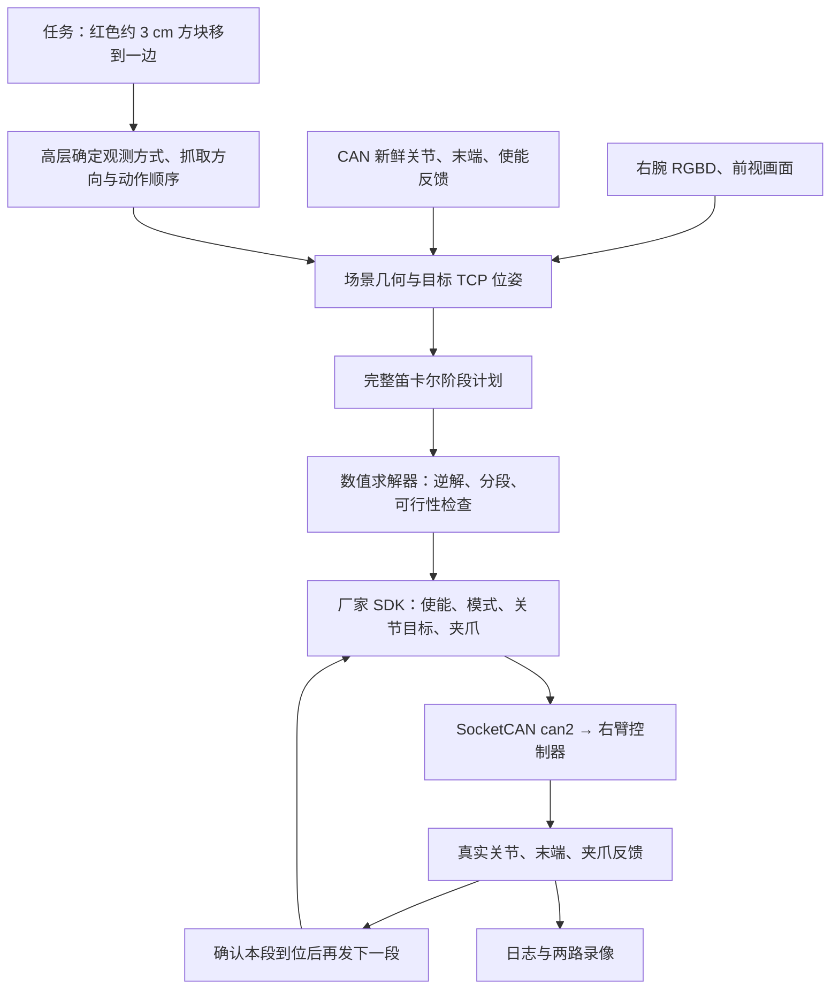

# 右臂抓放基线：从相机观测到真实运动的完整链路

本页保留的是较早的精细程序控制链，其原始归档见 [right_pick](../baselines/right_pick/README.md)。后续已新增 [模型直接规划与厂家逆解基线](../baselines/model_direct_vendor_ik/README.md)，详细过程见其 [CONTROL_CHAIN.md](../baselines/model_direct_vendor_ik/CONTROL_CHAIN.md)，危险下落见 [INCIDENT.md](../baselines/model_direct_vendor_ik/INCIDENT.md)。两条路线的当前对照以 [基线索引](../baselines/README.md) 为准；下文“本次”“当前”“后续”均指较早实验当时的状态。

本文件只说明 2026 年 10 月 4 日 03:48:11 开始、用户认可动作过程的这一次实验。它是后续实验的控制基线：先从画面和机械臂反馈建立场景，规划完整抓放动作，再由求解器计算关节目标，通过厂家 SDK 下发，并用真实反馈确认执行。

后续目标是**每个新任务零新增代码**：助手负责理解任务、判断画面、选择动作顺序和笛卡尔目标；已有求解器负责数值计算；固定的 SDK 调用入口负责执行和反馈。此次实验提供了这条链的实机依据，但尚不是直接接受任意自然语言任务的通用入口。

## 1. 本次保留下来的是什么

原始运行目录：[pick_attempt_20261003T194811_102398](../runs/pick_attempt_20261003T194811_102398)。目录名使用 UTC，现场时间使用北京时间。

本次已经证明“相机观测 → 目标估计 → 整体规划 → 逆解 → SDK 下发 → 机械臂真实运动 → 反馈确认”能够连通。完整计划包含 103 个运动段，实际发送 60 段，其中 59 段通过当时的到位判据；完成了抬高、展开、转腕和大部分接近动作，尚未执行闭爪。第 60 段末端已经接近目标，但 J6 的 0.195° 残差超过当时 0.15° 的到位阈值，程序结束下发。用户认可的是这次可见的动作过程和意图，不能把记录标为方块已经抓起、放置完成。

该运行共保存 243 条 SDK 发送帧、2,233 个执行轨迹采样点、两组 RGBD 快照，以及前视和右腕各 837 帧录像。最终反馈的 SDK 末端位置为 `[309.225, 256.731, 175.937] mm`，姿态为 `[180.000, 30.049, -140.299]°`。

## 2. 链路分工与设备



| 部分 | 本次实际设置 | 职责 |
| --- | --- | --- |
| 右臂通信 | `can2`，USB `1-6.3:1.0`，1,000,000 bit/s | SDK 指令及机械臂反馈 |
| 厂家 SDK | 本机 `piper_sdk 0.6.2`，`C_PiperInterface_V2` | 协议编码、解码和发送；官方正运动学 |
| 右腕相机 | 序列号 `244222070415` | 本次红块、桌面、夹指的定量 RGBD 几何来源 |
| 前视相机 | 序列号 `243622070374` | 全局观察及动作录像 |
| 相机采集 | 640×480，15 fps，深度对齐到彩色 | 保存 RGB、原始深度、米制深度、内参和时间戳 |
| 机器人解释器 | `~/miniconda3/envs/aloha/bin/python3` | SDK、SciPy 求解器和执行器 |
| 相机解释器 | `~/miniconda3/envs/pi0_infer/bin/python3.10` | RealSense 采集和录像 |

本机依赖为机器人端 Python 3.8、python-can 4.5.0、NumPy 1.24、SciPy 1.10.1、OpenCV 4.9；相机端 Python 3.10、pyrealsense2 2.56.5。具体设备配置保存在 [site.local.json](../configs/site.local.json)。

这次没有使用 ROS，也没有使用左臂、主臂或左相机。前视相机虽然保存了深度，本次几何求解只使用右腕相机；没有把两路图像当作完成了外参标定的双目系统。

## 3. 实际启动、连接和观测顺序

现场入口是 [try_right_pick.sh](../try_right_pick.sh)。它取得右臂实验锁、建立独立运行目录，然后用固定解释器启动 [run_right_pick.py](../scripts/run_right_pick.py)。用户在具有设备权限的普通终端启动，确认运动区域清空后按一次 Enter。助手环境本身没有直接访问本机 CAN 的权限，因此不能把“助手生成了参数”与“助手已直接连接硬件”混为一谈。

进入机器人流程后，程序按以下顺序工作：

1. 核对 `can2` 的物理 USB 绑定、总线状态和现有控制进程，读取静止时的关节、末端、状态及电机反馈。
2. 实例化厂家 SDK，建立发送连接，发送使能；等六个电机的新反馈都确认使能。
3. 启动前视、右腕两路采集，预热约 30 帧；之后持续录像。
4. 将空夹爪设为 **23 mm**，等待反馈稳定，再采集 `00_initial`。这次实际反馈是 **22.890 mm**。
5. 用这张右腕 RGBD 和同时保持不动的机械臂反馈估计几何。
6. 将夹爪张到 **55 mm**，这次实际反馈是 **54.320 mm**；确认机械臂仍保持观测姿态，保存 `01_prepared`。
7. 从同一初始姿态一次性求出整条抓放路径，检查全部阶段后才开始发关节运动目标。

23 mm 是为了让两个真实夹指表面都获得可靠的近距离深度；55 mm 是接近约 30 mm 方块时的工作开口。该方法假定两指对称运动，改变开口不改变夹爪中心 TCP 或相机安装位置。程序同时核对开合前后的关节、末端反馈没有漂移。

相机和 CAN 没有硬件同步。这里通过“采集时机械臂保持静止、采集前后核对姿态、各自记录时间戳”关联观测，不能把它称为同步视觉伺服。相机工作或离线规划期间，主线程继续接收 CAN，避免读取堆积的旧反馈。

## 4. 怎样从画面得到三维抓取目标

实现位置：[pick_scene_geometry.py](../scripts/pick_scene_geometry.py)。这次使用确定的视觉规则和几何计算；不是在执行过程中逐帧调用语言模型估算关节角。

### 4.1 像素与深度转相机坐标

令右腕相机坐标为 `C`，像素为 `(u,v)`，相机内参为 `fx,fy,cx,cy`，对齐后的深度为光轴方向 `z`。以毫米为单位：

```text
p_C = [(u - cx) × z / fx,
       (v - cy) × z / fy,
        z]
```

内参来自本次设备流，而不是沿用移动相机前的固定外参。原始深度 `0`、`65535` 标为无效；几何输入要求有效 RGBD、零畸变系数及深度已经对齐到彩色。本次两路内参中的畸变系数均为零。

### 4.2 桌面、红块和可放置区域

红色候选通过 HSV 色域和连通域确定，向内腐蚀后读取深度，减少边界混合像素。程序排除大小接近的多个候选，再检查红块相对桌面的高度是否符合约 3 cm 方块。

桌面点云排除红色区域，用随机采样及 SVD 拟合平面：

```text
n_C · p_C + d = 0
点距桌面的有符号高度 h(p_C) = n_C · p_C + d
```

本次桌面平面和目标测量值为：

| 测量量 | 本次结果 |
| --- | --- |
| 桌面单位法向 `n_C` | `[0.178437, -0.457107, -0.871329]` |
| 平面偏移 `d` | `352.769 mm` |
| 桌面拟合 RMS | `0.651 mm` |
| 红块高度估计 | `30.655 mm` |
| 红块顶面代表点 `p_cube,C` | `[12.031, -142.754, 448.000] mm` |
| 可见夹指表面中点 `m_C` | `[34.519, 47.551, 174.000] mm` |

放置候选选在红块两侧约 80 mm 的可见桌面上。每个候选检查半径 25 mm 的区域，要求深度充分、贴近桌面、没有红块像素。本次选用的候选区域有效深度比例为 100%，桌面残差的 95 分位数约 1.273 mm。

### 4.3 没有完整手眼标定时，如何建立近似方向

两个夹指在图像下部表现为深色连通域，只接受其中 120–300 mm 的近距离深度。用两指表面代表点之间的方向近似夹爪开合轴，并用指根到指尖的图像方向区分前后。

本次利用两条已知约束建立近似相机到机器人基座旋转：桌面法向对应基座 `+Z`，夹指开合轴对应当前 SDK 末端姿态的局部 `Y` 轴。将开合轴投影到桌面，并与桌面法向组成相机正交基 `C_basis`；将末端局部 `Y` 轴投影到基座水平面，并与基座 `+Z` 组成基座正交基 `B_basis`：

```text
R_BC ≈ B_basis × C_basisᵀ
```

开合轴有正负两个候选，选择其预测工具前向与图像中的夹指前向一致的那个。本次方向一致性分数约 0.99991，开合轴偏差约 0.946°。

这依赖基座正装、桌面水平、夹爪及相机安装稳定。它是本次尝试使用的近似几何，不能替代经过验证的手眼标定。桌面拟合精度很好，也不意味着整个相机到基座变换同样精确。

### 4.4 SDK 末端参考点、TCP 与物体坐标

`B` 表示机器人基座；`F` 表示 SDK 末端参考系，本次官方 FK 与厂家模型的末端位置一致；`T` 表示用于抓取的夹爪中心 TCP。SDK 报告的末端位置不是图像中可见的指尖。

本次采用 CAD 假设：TCP 在 `F` 坐标系的偏移为 `[0,0,135.8] mm`。设 SDK 反馈为位置 `p_BF`、旋转 `R_BF`：

```text
p_BT = p_BF + R_BF × [0, 0, 135.8]

任意相机点的近似基座坐标：
p_B ≈ p_BT + R_BC × (p_C - m_C)

规划 TCP 目标后，交给求解器的 SDK 末端位置：
p_BF,target = p_BT,target - R_BF,target × [0, 0, 135.8]
```

第二个式子把可见夹指表面中点 `m_C` 当作 TCP 的视觉锚点；两者并非严格同一点，所以本次为这项偏差预留了 12 mm，再加 3 mm 深度余量。该余量是规划假设，不是已测得的误差上界。

本次观测对应的 SDK 起点为 `[43.204,30.730,181.703] mm`，RPY 约 `[-144.879,70.104,-107.332]°`；计算得到：

| 基座坐标量 | 结果 |
| --- | --- |
| 初始 TCP | `[148.898,107.159,143.902] mm` |
| 红块顶面代表点 | `[367.672,306.340,-11.865] mm` |
| 估计桌面高度 | `Z = -41.679 mm` |
| 选中放置点的平面位置 | `X = 418.221 mm，Y = 244.334 mm` |

基座系的负 `Z` 只是估计桌面相对于机器人坐标原点的高度，不能当作负深度。以上数值只对应这一次观测，后续实验必须重新读取状态和画面。

## 5. 高层如何确定整条动作

本次选择“从当前观测规划整条路径，再逐段执行”，并没有实时追踪运动中的方块。高层计划如下；运动段数来自本次完整计划，而非全部已执行的记录。

| 阶段 | 目的和参数 | 计划运动段数 |
| --- | --- | ---: |
| 抬高 | 保持当前方向，将 TCP 向基座 `+Z` 移动 100 mm | 9 |
| 展开 | 高处调整 J2，并补偿 J5，使折叠姿态展开、腕部离开基座轴附近 | 13 |
| 转腕 | TCP 位置基本不变，转为朝向目标的下探姿态 | 15 |
| 接近 | 到红块上方；最终预抓 TCP 高度为估计桌面上方 92 mm | 24 |
| 下探 | TCP 降低 50 mm，到估计桌面上方 42 mm | 10 |
| 闭爪 | 目标开口 0，力矩参数 300，读取实际夹持反馈 | — |
| 抬升 | 保持夹持方向，向上移动 40 mm | 8 |
| 侧移 | 移到选中的空桌面，水平位移 80 mm | 7 |
| 放下 | 降低 40 mm | 9 |
| 释放 | 张开到 55 mm，并保存画面 | — |
| 撤离 | 向上移动 40 mm | 8 |

抓取方向由物体在基座中的方位角确定：`yaw = atan2(y_cube, x_cube)`，目标 RPY 为 `[180°,30°,yaw+180°]`，本次等价于 `[180°,30°,-140.199°]`。这个姿态使工具轴向下倾斜约 60°，开合方向保持水平。

最终 42 mm 的抓取高度由场景余量和整条路径检查共同选出，比测得的方块高度更高。可见夹指面与真实 TCP 的偏差可能抵消一部分高度差，也可能抓空；因此这是验证过程的保守目标，不是已经完成精确定位的抓取参数。

高层负责决定“先抬高再展开”“从哪一侧接近”“抬多高”“放到哪块空桌面”。接下来怎样求出六个关节角、怎样分成控制段，交给数值模块完成。

## 6. 本次逆运动学和路径检查由谁完成

实现位置：[pick_trajectory.py](../scripts/pick_trajectory.py)。本次实际是 **SciPy 数值逆解 + 厂家 SDK 正运动学校验 + SDK 关节控制**，不是厂家 Python SDK 返回了逆解结果。

本机 SDK 提供 `C_PiperForwardKinematics(dh_is_offset=1).CalFK(q_rad)`；其输入为关节弧度，末端结果为毫米和角度。程序先用当前实测关节做 FK，与当前 SDK 末端反馈比较，本次位置差约 0.0014 mm、方向差约 0.0020°，确认使用了匹配的模型和坐标约定。

逆解使用 `scipy.optimize.least_squares`，把末端位置误差与旋转误差组成残差：

```text
residual(q) = [p_FK(q) - p_target,
               100 × rotvec(R_target⁻¹ × R_FK(q))]
```

以上旋转项采用弧度，系数 100 是本次数值优化的权重。求解器以此前关节角为初值，在厂家关节范围内求解，得到结果后按 0.001° 量化，并再次用 FK 检查。单个逆解要求位置误差不超过 1 mm、方向误差不超过 0.5°。

| 关节 | 本次使用的目标角范围 |
| --- | --- |
| J1 | −150° 至 150° |
| J2 | 0° 至 180° |
| J3 | −170° 至 0° |
| J4 | −100° 至 100° |
| J5 | −70° 至 70° |
| J6 | −120° 至 120° |

TCP 位置用线性插值，方向用旋转插值；规划器进一步分段，使每段最大关节变化不超过 7.5°、SDK 末端位置变化不超过 14 mm、方向变化不超过 4.5°。这些是邻接目标的限制；因为最后使用 MOVE_J，两个目标间的真实路径不能等同为严格的笛卡尔直线。

路径检查采用厂家机械臂、夹爪几何与估计桌面。每段检查关节独立进展区间的 64 个角点，外加 9 个插值状态，并把关节跟踪范围扩展 ±0.5°。扣除 15 mm 的几何余量后，要求至少 10 mm 桌面间隙。本次检查 7,519 个状态，最小剩余间隙约 12.110 mm。

这项检查覆盖模型与桌面的关系；没有完整证明相机支架、线缆、非桌面障碍、自碰撞和连续路径极值。完整运动区域仍需要现场清空。整个计划在第一段机械臂运动下发前已生成并检查，不能把一段 IK 可解理解为整条抓放动作已可执行。

## 7. SDK 如何真正控制机械臂

以下是 API 的作用说明，**不是可以脱离反馈检查直接复制执行的脚本**。具体执行器为 [direct_sdk_pick.py](../scripts/direct_sdk_pick.py)，底层收发依赖 [direct_sdk_step.py](../scripts/direct_sdk_step.py) 与 [direct_sdk_live_step.py](../scripts/direct_sdk_live_step.py)。

### 7.1 实例化、连接和使能

| 操作 | 本次调用或机制 | 含义 |
| --- | --- | --- |
| 实例化 | `C_PiperInterface_V2("can2", judge_flag=False, can_auto_init=False)` | 先建立 SDK 对象，避免构造时自动开启通信 |
| 建立发送连接 | `CreateCanBus("can2", expected_bitrate=1000000, judge_flag=False)` | 使用已配置的右臂 SocketCAN 接口 |
| 接收反馈 | 有限执行器自己的 SocketCAN 接收器，加厂家 `C_PiperParserV2.DecodeMessage`、`ParseCANFrame` | 保存内核接收时间，同时更新 SDK 状态缓存 |
| 使能 | `EnablePiper()` | 发送 `0x471`，本次共发送 1 次 |
| 确认使能 | 读取发送以后到达的 `0x261`–`0x266` | 六个电机的 `driver_enable_status` 全部为真，且无故障 |

官方常规用法可以调用 `ConnectPort()` 启动 SDK 读取线程；**本次没有走这条连接入口**，而是单独接收反馈、保留内核时间戳、明确限制发送内容。不能为了把说明写短而把原执行链改写成另一种实现。

本机 `EnablePiper()` 的实现先取已有使能状态，再发送使能命令，其返回值反映读取时的状态。程序因此不把一个 `True` 返回值当作本次发送已经完成使能的证明，而是等新的六电机反馈。

### 7.2 逐段发送关节目标

每个已求解的运动段依次调用：

| API | 本次参数 | 产生的控制帧 |
| --- | --- | --- |
| `MotionCtrl_2` | `(1,1,5,0)`：CAN 控制、MOVE_J、5% 速度、普通位置速度模式 | `0x151` |
| `JointCtrl` | 六个整数关节角，单位 0.001° | `0x155`、`0x156`、`0x157` |

例如本次第一段的六关节目标为 `[36562,1528,-2753,-1741,22396,-9958]`；其对应的 SDK 末端目标为 `[43.205,30.731,192.813] mm`。这些是历史证据，不能作为当前姿态下的直接运动命令。

发送前先由厂家 SDK 编码出预期 CAN 帧，再由执行器核对帧内容、顺序、数量和反馈状态。实际仍通过 SDK 的发送实现发出，日志逐条记录 CAN ID、载荷和时间。每段只发送一个目标，不在 Python 中生成伺服电流或重复刷新关节目标。机械臂控制器完成底层运动执行。

### 7.3 到位闭环

| 反馈帧 | 信息 |
| --- | --- |
| `0x2A1` | 控制模式、运动模式、运动状态、错误码 |
| `0x2A2`–`0x2A4` | SDK 末端 XYZ、RPY |
| `0x2A5`–`0x2A7` | 六关节实测角度 |
| `0x261`–`0x266` | 六电机使能及故障状态 |
| `0x2A8` | 夹爪实测开口、力矩相关反馈、状态 |

本次必需反馈帧的年龄限制为 100 ms，按内核收到帧的时间计算，而不是按 Python 读到它的时间计算。控制器持续接收数据，轨迹记录和模型检查限制在约 50 Hz，避免高频分帧反馈造成计算积压。

每段最多等待 5 秒，须同时满足末端位置误差、旋转误差、关节误差、静止状态、使能状态及新反馈条件，并稳定约 0.2 秒，才发送下一段。本次位置阈值为 0.5 mm、旋转阈值为 0.25°、每关节阈值为 0.15°；姿态差用旋转计算，不能直接相减 `+180°` 和 `−180°`。当前工作代码后来将关节到位阈值调整为 0.3°，应把它视作后续版本，不能反写进本次原始结果。

命令被本机 CAN 套接字接受，和机械臂已实际到位，是两件需要分别记录的事。如果执行被中止，程序停止继续下发并额外观察约 5 秒，不自动失能或复位。关闭通信也不撤销控制器已经接受的目标。

### 7.4 夹爪控制与抓取判定

本次实际使用 `GripperCtrl(23000,300,1,0)` 和 `GripperCtrl(55000,300,1,0)`，均产生 `0x159`。参数依次表示开口、力矩参数、使能代码、是否置零；`300` 对应执行程序采用的 0.3 N·m 参数，`1` 表示使能，末项 `0` 表示不置零。它不是已经标定的夹持接触力。

完整计划中的闭爪目标为 `0`，释放目标为 `55000`。固定执行逻辑用稳定的反馈区分情况：开口 20–45 mm 且有非零力矩反馈为“接触候选”；开口不超过 8 mm 为“抓空”；其余不明确状态停止后续搬运。抓空时可以完成空载的抬升、侧移、释放过程，但结果记为未抓到。即使有接触候选，也需要抬升及放置画面验证物体，不能仅凭夹爪开口宣称成功。

## 8. 后续“每任务不再写代码”的具体含义

目标工作方式应固定为：

```text
任务描述 + 当前相机画面 + 当前机械臂状态
    ↓ 助手理解、判断并选择动作
物体/放置区域 + TCP 目标位姿 + 阶段顺序 + 速度/开口/完成条件
    ↓ 已有求解器或机器人固件
可执行轨迹/关节目标
    ↓ 固定 SDK 调用入口
机械臂执行、反馈与新画面
    ↓ 助手判断下一步或结束
```

助手不需要为每个方块位置重写颜色检测、逆解、CAN 协议、反馈循环；也不应靠语言推理逐个算出六关节角。每次变化的应当是结构化任务参数，例如目标对象、抓取 TCP、放置 TCP、接近方向、抬升高度、夹爪开口和是否重新观测。设备绑定、单位换算、求解器调用、执行状态机、日志格式应只配置一次并复用。

求解和执行可以选择两条稳定路线：

| 路线 | 助手交付 | 数值计算由谁负责 | SDK 执行方式 | 当前证据 |
| --- | --- | --- | --- | --- |
| 外部求解器 | TCP/末端路径及约束 | 已有 IK/规划器 | `JointCtrl` | 本次已经真实走通的是 SciPy + 官方 FK 的这一类路线 |
| 机器人固件 | 转换到 SDK 参考点的笛卡尔目标和运动模式 | 机械臂控制器处理笛卡尔运动 | `EndPoseCtrl`，通过 `0x152`–`0x154` 发送目标 | 本机 SDK 有接口；完整抓放流程尚未按此路线实机验证 |

本机 SDK 的 `EndPoseCtrl(X,Y,Z,RX,RY,RZ)` 将笛卡尔坐标编码发送；位置单位 0.001 mm，角度单位 0.001°。它本身没有在 Python 中返回六关节逆解，使用前需要选定相应的末端运动模式，并核实固件对目标的接受和执行。转向该路线后仍需处理 TCP 换算、可达性、碰撞关系及到位反馈；固件 IK 不能代替理解画面和任务。

“除了 SDK，不再为任务写代码”可以作为最终使用方式。就当前本机条件而言，SDK 没有相机理解能力，也没有直接供对话调用的通用任务入口。若已有现成的相机、求解器和 SDK 工具可调用，就直接配置并复用；否则仍需一次性的最小通用调用层，把观测、结构化目标、求解和执行接起来。这不是每个任务再写一套程序，也不是本次已经完成的功能。本次整理没有新建这套框架，保留的是可核对的实机控制基线。

## 9. 资料与代码如何对应

| 需要核对的问题 | 对应资料 |
| --- | --- |
| 实际看到了什么 | [23 mm 开口的原始观测](../runs/pick_attempt_20261003T194811_102398/camera_recording/00_initial/observation.json)、[右腕 RGB](../runs/pick_attempt_20261003T194811_102398/camera_recording/00_initial/right_hand.png)及同目录深度 |
| 张开后是否仍是同一场景 | [55 mm 开口的准备观测](../runs/pick_attempt_20261003T194811_102398/camera_recording/01_prepared/observation.json) |
| 计划、目标、实际反馈和发出的字节 | [report.json](../runs/pick_attempt_20261003T194811_102398/report.json) 的 `geometry`、`plan`、`stages`、`transmissions`、`trace` |
| 实机完整可见过程 | [前视录像](../runs/pick_attempt_20261003T194811_102398/camera_recording/front.avi)、[右腕录像](../runs/pick_attempt_20261003T194811_102398/camera_recording/right_hand.avi)；实际帧时间见同目录 `video_frames.jsonl` |
| 启动与整体编排 | [try_right_pick.sh](../try_right_pick.sh)、[run_right_pick.py](../scripts/run_right_pick.py) |
| 相机采集与记录 | [pick_camera_worker.py](../scripts/pick_camera_worker.py) |
| 画面到几何 | [pick_scene_geometry.py](../scripts/pick_scene_geometry.py) |
| 几何到完整计划和逆解 | [pick_trajectory.py](../scripts/pick_trajectory.py)、同目录两份 `vendor_*` 几何数据 |
| 计划到 SDK，再到反馈 | [direct_sdk_pick.py](../scripts/direct_sdk_pick.py)、[direct_sdk_live_step.py](../scripts/direct_sdk_live_step.py)、[direct_sdk_step.py](../scripts/direct_sdk_step.py) |

后续实验继承这条分工和设备连接，每次重新观测、重新求解，不直接回放本次历史坐标。当前工作源码中包含本次之后的离线修正；原始 `report.json` 和录像是判断本次真正发生了什么的依据。
